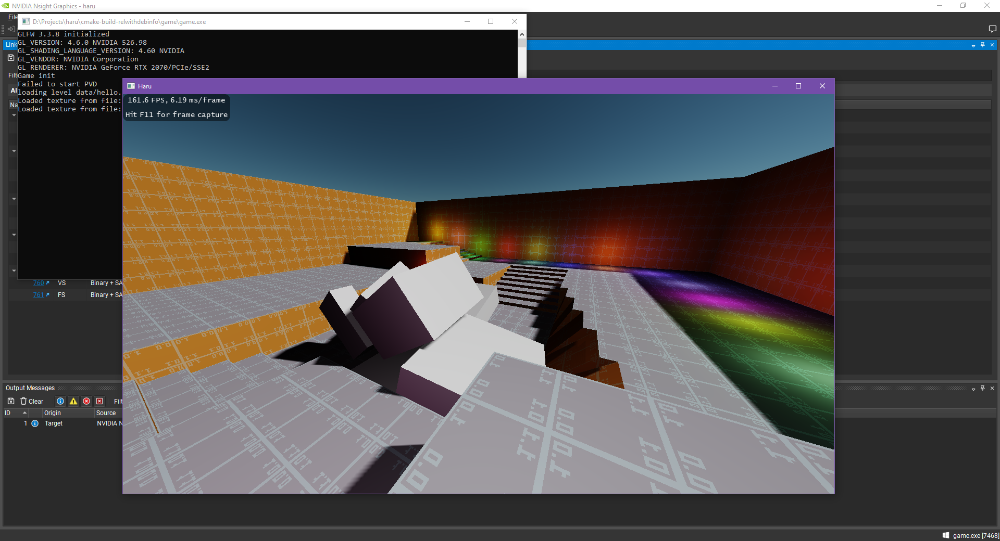

# Haru Engine

A (puzzle?) game engine. Somewhat inspired by Quake/Source Engine.

## Features

- Level Editing
    - Modified TrenchBroom: https://github.com/andyroiiid/TrenchBroom-Haru
- Rendering
    - Modern OpenGL
    - Deferred Rendering Pipeline
    - Cascade Shadow Map
- PhysX Integration

## Next Steps

- Scripting
    - Entity Events
    - Lua Level Script
- UI
    - Immediate-mode UI System
- Sound
    - [FMOD](https://fmod.com/) Integration?
    - [OpenAL Soft](https://openal-soft.org/) Integration?
    - [miniaudio](https://miniaud.io/) Integration?
