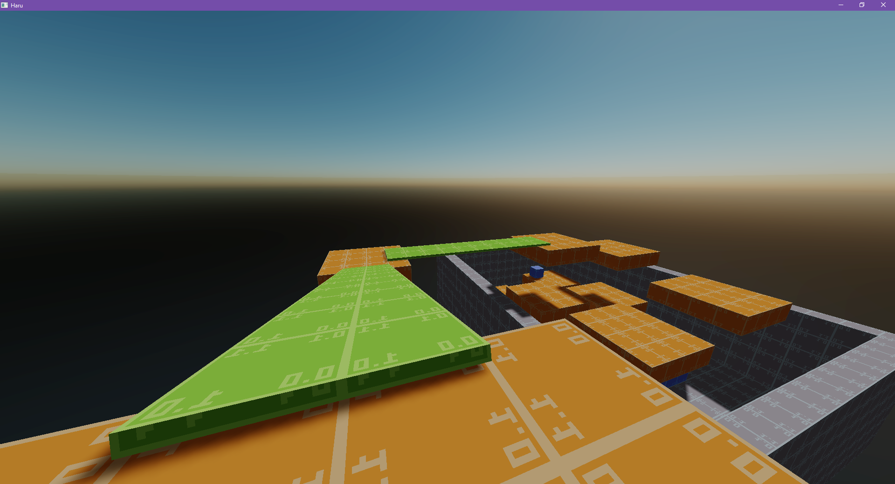

# Haru Engine

A (puzzle?) game engine. Somewhat inspired by Quake/Source Engine.

## Features

- Level Editing
    - Modified TrenchBroom: https://github.com/andyroiiid/TrenchBroom-Haru
    - Custom level format
- Game Entities
    - First-person controller
    - Static/kinematic/physically-simulated BSP brushes
    - Quake/Hammer style entities
- Rendering
    - Modern OpenGL
    - Deferred Rendering Pipeline
    - Deferred Lighting System
    - Cascade Shadow Map
    - Quake MDL model parsing & loading
- PhysX 5 Integration
    - The integration code is based on one of my old projects
    - NVIDIA didn't change much of the API so PhysX 4 could probably also work

## Next Steps

- Scripting
    - Entity Events
    - Lua Level Script
- UI
    - Immediate-mode UI System
- Sound
    - [FMOD](https://fmod.com/) Integration?
    - [OpenAL Soft](https://openal-soft.org/) Integration?
    - [miniaudio](https://miniaud.io/) Integration?

## Dependencies

- [glfw](https://github.com/glfw/glfw)
    - Window handling
- [glm](https://github.com/g-truc/glm)
    - Mathematics
- [glad](https://github.com/Dav1dde/glad)
    - OpenGL function loading
- [stb](https://github.com/nothings/stb)
    - stb_image.h for image loading
- [PhysX 5](https://github.com/NVIDIA-Omniverse/PhysX)
    - Physics engine
- [physfs](https://github.com/icculus/physfs)
    - File system abstraction
- [simdjson](https://github.com/simdjson/simdjson)
    - JSON parsing
- [tracy](https://github.com/wolfpld/tracy)
    - Profiling tool
